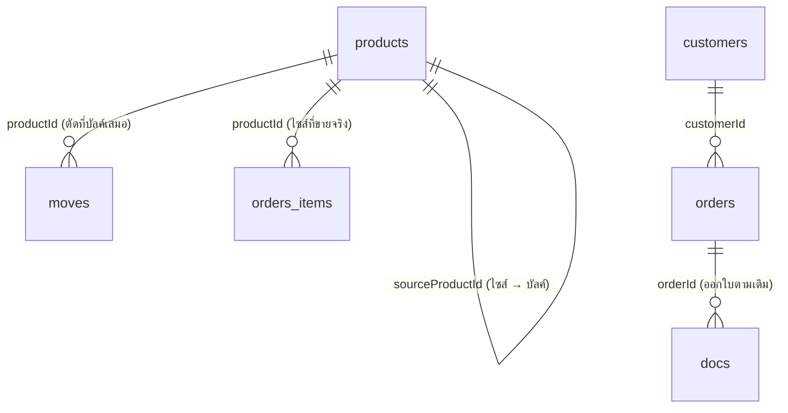

# ARCHITECTURE — JAMAREE GAS
> ผังทะเบียน · SoT ของโครงสร้างข้อมูล · แก้ที่นี่ก่อนแก้โค้ดเสมอ
> อ่านคู่กับ `CLAUDE.md` (กติกา/ดีไซน์) — ไฟล์นี้คือโครงกระดูก
> **แหล่งความจริง:** อ่านจาก `erp.html` จริง (บรรทัด 277 `fresh()`, 678 `addMove()`, 878-991 โมดูลออเดอร์) ไม่ใช่เดา

## สถานะ
โครงเดิมของ `erp.html` (จากสวีท BizSuite) มีทะเบียน/รายการเคลื่อนไหวทั่วไปอยู่แล้ว (ลูกค้า/สินค้า/ออเดอร์/เอกสาร/การเงิน/พนักงาน ฯลฯ) — เอกสารนี้โฟกัสเฉพาะ **ส่วนที่ต้องปรับ/เพิ่มเพื่อรองรับธุรกิจโรงบรรจุแก๊ส** (MVP รอบแรก: "น้ำแก๊ส" เท่านั้น — ยังไม่ทำถังเปล่า/ถังหมุนเวียน/มัดจำ)

---

## 1. ทะเบียน (Master) — ใช้ `products[]` เดิม ไม่สร้างตารางใหม่

| ทะเบียน | key ใน db | fields (ที่เกี่ยวกับแก๊ส) | natural key | อ้างใคร | ลบได้ไหม |
|---|---|---|---|---|---|
| สินค้า (มีอยู่แล้ว) | `products` | id, sku, name, unit, stock, lowAt, cost, price, **sourceProductId** (ใหม่), **unitKg** (ใหม่) | sku | – | ❌ ยังไม่มี active flag ในโครงเดิม — เลิกขายไซส์ไหนให้ตั้งราคา/ซ่อนจากฟอร์มขายไปก่อน อย่าลบถ้ามี moves/orders อ้างอยู่ |

**⭐ การตัดสินใจหลักของรอบนี้ — ไม่สร้างทะเบียนใหม่ ใช้ `products` 2 บทบาท:**

1. **บัลค์แทงค์ (bulk source)** — 1 แถว มีสต๊อกจริง
   `{ id:"p_bulk", sku:"GAS-BULK", name:"แก๊สดิบ (ถังใหญ่)", unit:"กก.", stock:15000, lowAt:1000, cost:<ต้นทุน/กก.>, price:null, sourceProductId:null, unitKg:null }`
   - รับแก๊สดิบเข้า = `addMove("p_bulk","รับเข้า",qty)` ผ่านหน้าสินค้าเดิม ไม่ต้องแก้อะไร

2. **ไซส์ขาย (sell size)** — 1 แถวต่อไซส์ **ไม่มีสต๊อกของตัวเอง**
   `{ id, sku:"GAS-48"/"GAS-15"/"GAS-4"/"GAS-11.5", name:"ถัง 48 กก.", unit:"ถัง", stock:0, lowAt:null, cost:null, price:<ราคาขาย/ถัง>, sourceProductId:"p_bulk", unitKg:48 }`
   - `stock` ของแถวนี้ **ค้างที่ 0 ตลอด ไม่มีความหมาย** (กันสับสน: ต้องซ่อนคอลัมน์คงเหลือของ product ที่มี `sourceProductId` ในหน้าสินค้า/ตอนเลือกสินค้าในออเดอร์ — โชว์ "แปลงจาก <ชื่อบัลค์> (เหลือ X กก.)" แทน)
   - natural key กันซ้ำ: `(sourceProductId, unitKg)` ห้ามมี 2 ไซส์น้ำหนักเท่ากันจากบัลค์เดียวกัน

---

## 2. รายการเคลื่อนไหว (Transaction) — ใช้ `moves[]` + `orders[]` เดิม

| รายการ | key | fields | FK | เลขเอกสาร | ใครอ่าน | แก้ย้อนหลัง |
|---|---|---|---|---|---|---|
| ออเดอร์ขาย | `orders` (มีอยู่แล้ว) | id, customerId, date, status, items:[{productId,qty}] | items[].productId → **ไซส์ขาย** (ไม่ใช่บัลค์โดยตรง) | – | รายงานขาย, `orderTotal()`/`orderProfit()` (ราคาดึงสดจาก `product.price`) | แก้ก่อนปิดออเดอร์ได้ตามเดิม |
| ตัดสต๊อก | `moves` (มีอยู่แล้ว) | id, date, productId, type, qty, note, `sizeProductId` (ฟิลด์ extra ใหม่) | productId → **บัลค์แทงค์เสมอ** (ไม่ใช่ productId ของไซส์ที่ขาย) | – | แดชบอร์ด (คงเหลือ/ของใกล้หมด), การ์ดสต๊อก | ❌ ปรับผ่าน `addMove('ปรับเพิ่ม'/'ปรับลด')` เท่านั้น |

**⭐ กติกาตัดสต๊อก (ต้องแก้โค้ด `completeOrder()` — ยังไม่ได้แก้ในรอบ /registry นี้ บันทึกไว้ให้ทำต่อ):**

จุดเดิม (erp.html:988): `o.items.forEach(it=>addMove(it.productId, "เบิกออก", it.qty, "ขาย/ออเดอร์"))` — ตัดสต๊อกของ `it.productId` ตรง ๆ

ต้องเปลี่ยนเป็น: สำหรับแต่ละ item —
```
p = products.find(it.productId)
if (p.sourceProductId) {
   // ไซส์ขาย → ตัดที่บัลค์แทงค์ ตามน้ำหนัก
   addMove(p.sourceProductId, "เบิกออก", it.qty * p.unitKg, "ขาย/ออเดอร์", {sizeProductId: it.productId})
} else {
   // สินค้าปกติ (ไม่เกี่ยวกับแก๊ส) → ตัดของตัวเองเหมือนเดิม
   addMove(it.productId, "เบิกออก", it.qty, "ขาย/ออเดอร์")
}
```
เช็ค "ของไม่พอ" (erp.html:986) ก็ต้องเทียบกับ `sourceProductId.stock` แทนเช่นกันเมื่อมี `sourceProductId`

**derived (คำนวณสด ห้ามเก็บ):**
- คงเหลือถังใหญ่ = `products.find(p_bulk).stock` (ของจริง อัปเดตผ่าน `addMove` จุดเดียวอยู่แล้ว — ไม่ต้องเปลี่ยน)
- "ขายไปกี่ถังต่อไซส์" = group `orders.items` (หรือ `moves` ที่มี `sizeProductId`) ตาม productId ของไซส์ — ไม่เก็บ counter แยก

---

## 3. ค่าคงที่ (Reference)
ไม่มีเพิ่มสำหรับรอบนี้ — ใช้ระบบ VAT/WHT/เลขเอกสารเดิมของ BizSuite ได้ทันที (docs/docCounters ไม่ต้องแตะ เพราะยังคง snapshot `{name,qty,price}` จาก order item เหมือนเดิมไม่ว่าที่มาของสต๊อกจะเป็นบัลค์หรือไม่)

---

## 4. แผนที่ความสัมพันธ์


---

## 5. กติกาเหล็กของรอบนี้
- ❌ ห้ามสร้างทะเบียน "ไซส์แก๊ส" แยกตารางใหม่ — ใช้ `products` เดิม + 2 field ใหม่ (`sourceProductId`, `unitKg`) พอ
- ❌ ห้ามให้ไซส์ขายมีสต๊อกของตัวเอง (`stock` ต้องล็อกที่ 0 ในหน้าแก้ไขสินค้า ถ้ามี `sourceProductId`)
- ✅ ทุกจุดตัดสต๊อกยังคงผ่าน `addMove()` ทางเดียวเหมือนเดิม (แค่เปลี่ยน "ตัดใคร" ไม่เปลี่ยนกลไก)
- ✅ เตือนของใกล้หมด ใช้ `lowAt` ของ**บัลค์แทงค์**เท่านั้น (ไซส์ไม่ต้องมี lowAt)

## 6. เผื่ออนาคต (เฟส 2 — ยังไม่ทำตอนนี้ ห้ามสร้างล่วงหน้า)
เมื่อจะเพิ่ม **ถังเปล่าใหม่** (ไซส์ "15 กก.ใหม่" / "4 กก.New" ที่ต้องตัดทั้งกก.แก๊ส + ถังเปล่า 1 ใบพร้อมกัน) และ **ถังหมุนเวียน/มัดจำ**:
- ขยาย `sourceProductId` (ค่าเดี่ยว) → `recipe:[{productId, qty}]` (array) แทน — เปลี่ยนโค้ดจุดเดียว (`completeOrder`) ไม่กระทบข้อมูลเดิม เพราะ `sourceProductId+unitKg` แปลงเป็น `recipe:[{productId:sourceProductId, qty:unitKg}]` ได้ตรง ๆ
- ถังหมุนเวียนที่ลูกค้าถืออยู่ = ทะเบียนใหม่ต่างหาก (เช่น `cylinderLoans[{customerId, size, qty, depositAmt}]`) — ยังไม่ออกแบบตอนนี้ตามที่เจ้าของร้านขอ

---

## 7. ทะเบียน → หน้าจอ
| ทะเบียน/รายการ | หน้า | ชนิดหน้า |
|---|---|---|
| บัลค์แทงค์ (แก๊สดิบ) | แท็บ "สินค้า" (การ์ด/แถวพิเศษ) | CRUD + ปุ่ม +รับเข้า (มีอยู่แล้ว) |
| ไซส์ขาย (48/15/4/11.5 กก.) | แท็บ "สินค้า" | CRUD ตรงไปตรงมา (เพิ่ม field ผูกบัลค์ตอนสร้าง) |
| ขาย | แท็บ "ออเดอร์" | ⚠️ จอตัดสต๊อก — ต้องแก้ `completeOrder()` ตามข้อ 2 ก่อนใช้จริง |

---

## จุดที่ตัดสินใจแทนแล้ว (5 ข้อ — รบกวนเช็คให้ตรงกับที่คุยกันไว้)
1. ไซส์ขาย = `products` แถวหนึ่งที่ `stock` ล็อก 0 ไม่ใช่ตารางแยก — เพื่อใช้กลไก orders/completeOrder เดิมได้เต็มที่
2. ตอนขาย ตัดกก.จากบัลค์แทงค์เสมอ ไม่ตัดสต๊อกของไซส์ (เพราะไซส์ไม่มีสต๊อกจริง)
3. ยังไม่ทำถังเปล่า/ถังหมุนเวียน/มัดจำในรอบนี้ตามที่ขอ — เผื่อโครงไว้ผ่าน `sourceProductId`→`recipe[]` ในอนาคตแทนที่จะสร้างตารางว่างล่วงหน้า
4. ราคาขายต่อไซส์ = field `price` บน product ไซส์นั้น ๆ (ไม่ผูกสูตรคำนวณจาก กก. อัตโนมัติ เพราะแต่ละไซส์มักมีต้นทุนคงที่/ค่าถังไม่เท่ากันต่อกก.)
5. ยังไม่แตะระบบเอกสาร/VAT/WHT เดิม — ใช้ของ BizSuite ที่มีอยู่แล้วได้ทันทีโดยไม่ต้องแก้

## ยังไม่ได้ทำ (ต้องทำต่อก่อนใช้งานจริง)
- [ ] แก้ `completeOrder()` (erp.html:981-991) ให้ตัดสต๊อกผ่าน `sourceProductId` ตามข้อ 2
- [ ] ซ่อน/ปรับ label คงเหลือของไซส์ขายในดรอปดาวน์เลือกสินค้า (erp.html:922) ไม่ให้โชว์ "คงเหลือ 0 ถัง" น่าสับสน
- [ ] สร้างข้อมูลจริง: 1 แถวบัลค์แทงค์ + 4 แถวไซส์ขาย (48/15/4/11.5 กก.) แทนข้อมูลตัวอย่างเดิม

ชวนต่อ: พร้อมแล้วบอกได้เลย ผมแก้ `completeOrder()` ตาม ARCHITECTURE.md นี้ให้ทันที (ไม่ต้องรัน `/new-module` เพราะไม่ใช่โมดูลใหม่ — เป็นการปรับ flow ตัดสต๊อกของโมดูลเดิม)
